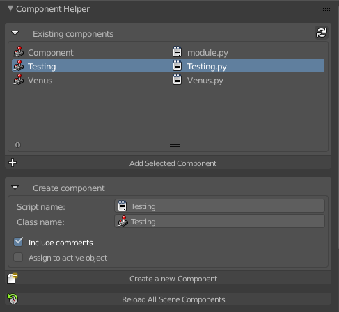

# UPBGE Addons
###### Created by Guilherme Teres Nunes

These addons where created by me to help creating games using UPBGE (software [available here](download.upbge.org)). 

Feel free to open issues whenever needed or if you want to suggest some good addon.

Here is a list of the addons:

## Component Helper
###### File: **Addons/component_helper.py**

This addon will help you to handle your Python Components, such as creating or adding new components to the objects.
Once you installed the addon, go to **Logic Editor > Properties tab > Component Helper** to use the addon.



In this image you can see an small example of the addon in action: 

- The first block will display all the existing Components (+ Script name) found in the .blend file. Note that you will need to click on the icon located on the top right (the arrows) to update the list.

- The second block is a small tool to create a new component: you just have to type the script name and the class name (white spaces will be automatically ignored and add the ".py" at the end of the script name is optional) and mark/unmark the two aditional options if you want to: (1) Include some instructions (comments) in the initial component code or (2) also add the created component to the current selected object.


## Input Mapping
###### File: **Addons/input_mapping.py**

This addon will help you to handle keyboard, mouse and joystick (wip) inputs. Once you installed the addon, go to **Properties > Scene > Input Mapping** to use the addon.

First you have to create one or more **Input Maps**, then, rename it and add as much keys as you want. Here is a small example:


In this image you can see a list of three maps: Forward, Side and Jump. The selected one (Forward) where created to handle Front and Back movements with the keys W and S and also Up and Down Arrows.

Once you setup your input maps, click in **Generate Script** and, then, you will be able to import these values in your own scripts by typing:

```
import InputMapping
```

If you want to acces the value of the Forward map, or if the user just pressed or released any key of this map, I can do:

```
value = InputMapping.Forward.value()
pressed = InputMapping.Forward.pressed()
released = InputMapping.Forward.released()
```

You can check which values can you add to the key field here:

https://pythonapi.upbge.org/bge.events.html#keys-constants

**Note:** Don't include the "bge.events." part. Also, the addon is a little bit smart so you don't need to type everything using Capitals or without spaces.
